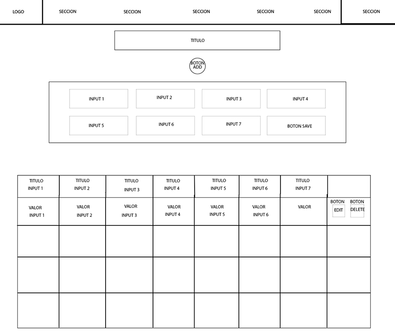

# Registro de Pedidos

* [1. Intro](#1-introduccion)
* [2. Vinculo](#2-vinculo)
* [3. Descripcion](#3-descripcion)
* [4. Aprendizajes Obtenidos](#4-aprendizajes-obtenidos)

## 1. Introduccion

Este proyecto es parte de la segunda entrega del Bootcamp UDD, un programa intensivo de aprendizaje de desarrollo web.
El objetivo es crear una aplicación web que permita gestionar los pedidos de una empresa, usando las tecnologías HTML, CSS y JavaScript.

****

## 2. Vinculo
[Enlace] (https://pepeoawvh.github.io/PROYECTO2CRUDappTablaPedidos/)

****

## 3. Descripcion

La aplicación se llama "Registro de Pedidos para pymes" y consiste en una interfaz sencilla y funcional que permite al usuario realizar 
las operaciones CRUD (Create, Read, Update, Delete) sobre los datos de los pedidos. La aplicación Almacena los datos en LocalStorage.

 La aplicación tiene las siguientes funcionalidades:

- Agregar un nuevo pedido, ingresando los datos en un formulario y presionando el botón "+".

- Ver la lista de todos los pedidos, mostrados en una tabla con los campos "Origen", "Fecha", "Código de Pedido", "Cliente", "Estado", "Envío" y "Facturación".

- Editar un pedido existente, haciendo clic en el botón "Editar" correspondiente a cada fila de la tabla, modificando los datos en el formulario y presionando el botón "Guardar".

- Eliminar un pedido existente, haciendo clic en el botón "Eliminar" correspondiente a cada fila de la tabla y confirmando la acción.

 
## Contexto de uso

Esta aplicación puede ser útil para cualquier empresa que necesite llevar un control de sus pedidos, 
ya sea que se trate de productos o servicios. La aplicación permite tener una visión general de los pedidos realizados, 
su estado, su origen y su destino. Además, facilita la actualización y el borrado de los pedidos, según las necesidades del negocio.

La aplicación puede adaptarse a diferentes tipos de empresas, cambiando los campos del formulario y de la tabla según los datos que se quieran registrar. 
Por ejemplo, se podría agregar un campo para el tipo de producto o servicio, el precio, la cantidad, el descuento, etc.

****

## 4. Aprendizajes Obtenidos 

Durante el desarrollo de este proyecto, se adquirieron diversos conocimientos sobre HTML, CSS y JavaScript, 
que se aplicaron en la creación de la aplicación. Algunos de estos conocimientos son:

- HTML: Se usó HTML para crear la estructura básica de la página web, usando etiquetas semánticas como `<header>`, `<main>`, `<form>`, `<table>`, etc.
- Se usaron atributos como `id`, `class`, `type`, `name`, `value`, etc. para identificar y manipular los elementos.
- Se usaron elementos como `<input>`, `<select>`, `<option>`, `<button>`, etc. para crear el formulario interactivo.

- CSS: Se usó CSS para darle estilo y diseño a la página web, usando propiedades como `color`, `font-family`, `font-size`, `background-color`, `border`, `margin`, `padding`, etc.
- Se usaron selectores como `#id`, `.class`, `element`, `element:hover`, etc. para aplicar los estilos a los elementos.
- Se usaron reglas como `@media` para hacer que la página sea responsive y se adapte a diferentes tamaños de pantalla.

- JavaScript: Se usó JavaScript para darle funcionalidad y dinamismo a la página web, usando variables, funciones, eventos, condicionales, bucles, etc.
- Se usó el objeto `document` para acceder y modificar el DOM (Document Object Model), usando métodos como `getElementById()`, `getElementsByClassName()`, `createElement()`, `appendChild()`, `removeChild()`, etc.
- Se usó el objeto `window` para acceder a propiedades y métodos globales, como `alert()`, `confirm()`, `localStorage()`, etc.
  

## Conclusión
Este proyecto fue una gran oportunidad para poner en práctica los conocimientos adquiridos durante el MODULO 1, 
así como para aprender nuevos conceptos y herramientas. El desarrollo de una aplicación web que cumple con las operaciones CRUD fue un reto interesante y gratificante, 
que permitió demostrar las habilidades y competencias como desarrollador web.

El proceso de aprendizaje fue intenso y exigente, pero también divertido y motivador. 
Se pudo apreciar la importancia de tener una buena base teórica, pero también de experimentar y resolver problemas mediante la práctica. 
Se pudo comprobar la utilidad y el potencial de las tecnologías HTML, CSS y JavaScript, para crear aplicaciones web funcionales y atractivas.

 
Finalmente, se puede decir que este proyecto fue una experiencia enriquecedora, que contribuyó al crecimiento profesional y personal, 
y que abrió las puertas a nuevas posibilidades y oportunidades en el campo del desarrollo web.

****
